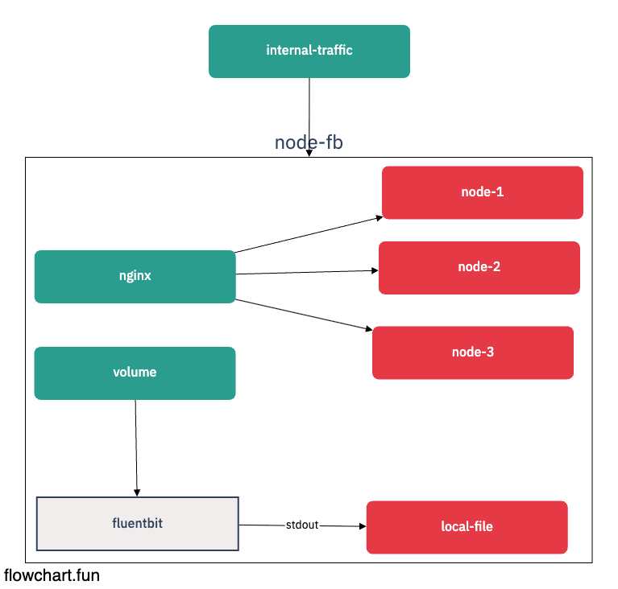

# Resource Monitoring

## Architecture



- [ ] Fluentbit으 로 어디까지 가능한가?

  - [x] output logging (attach)
  - [x] output file log (attach)
  - [x] output logging (sidecar)
  - [ ] output use s3 in AWS
  - [ ] fluentbit + elasticsearch + kibana

- [ ] Prometheus로 System Metric 보기
  - [ ] node-exporter

## Exec

```sh
    alias dc='docker-compose'
```
